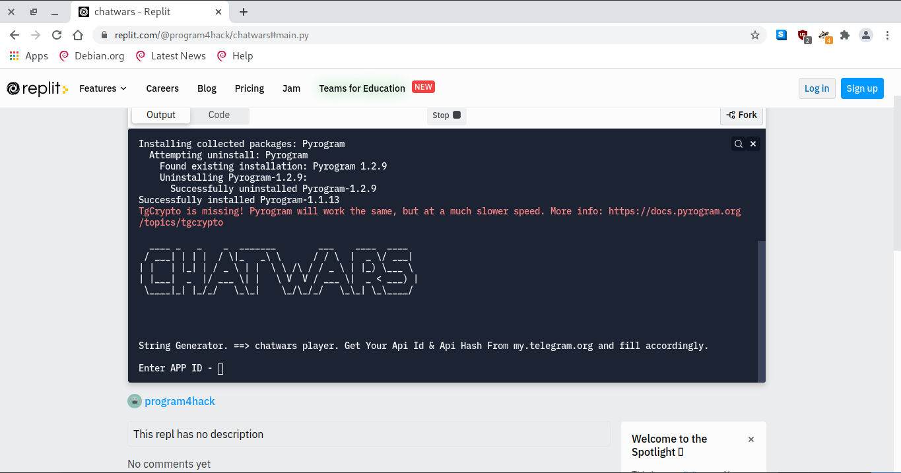
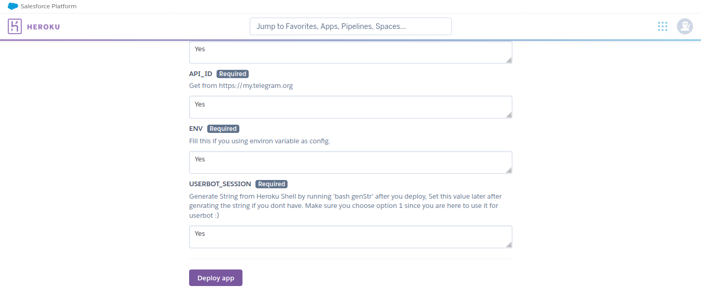
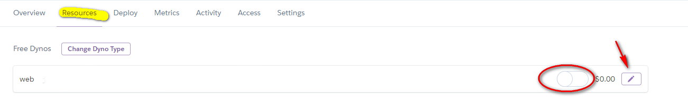
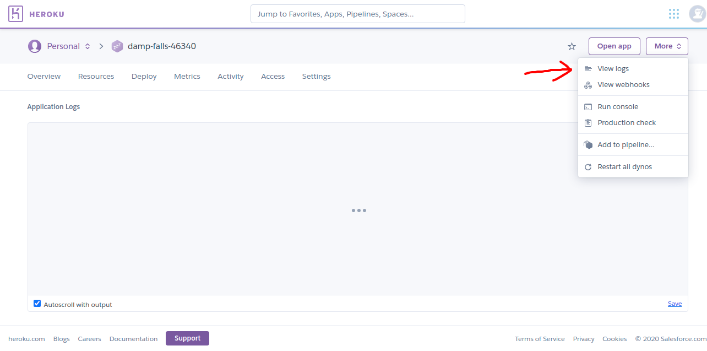

# ***Chat Wars Script Written By AK Hacker***

This is developed for playing the chat wars game This will automatically click the Buttons like forest arena and other buttons one by one after 7 minutes of delay

Setup:

1. First of all click the heroku Button given below

Heroku Button:

2. Get Your Api ID and API Hash using the website https://my.telegram.org/app
3. Then open the link below and click on "Run" and then put your api id and api hash and phone number accordingly and login to your telegram account to get the session string

4. Then put all the things in your heroku page you get from the heroku button and click on deploy app

###### **IT WIll deploy your userbot on heroku**

**Now Open your heroku dashboard and go to the app and Go to resources and trun on the dyno**

### **To check the the error if any go to logs**

# **Enjoy the Chatwarsplayerbot**
